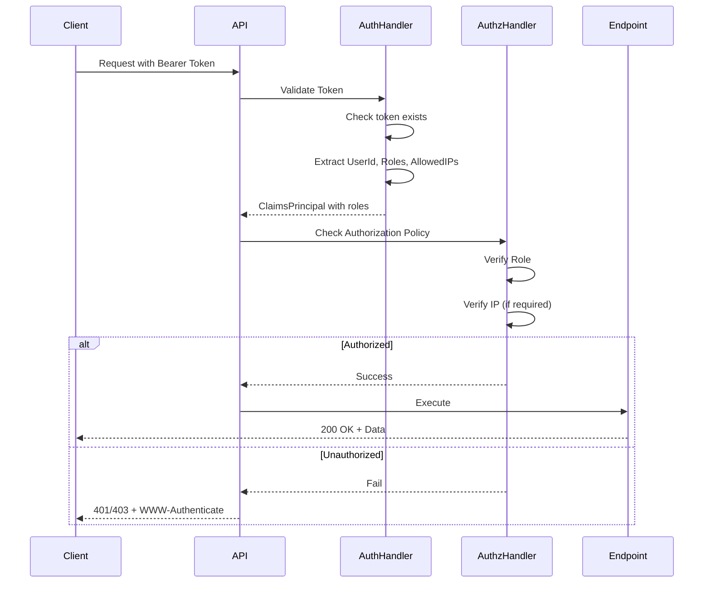
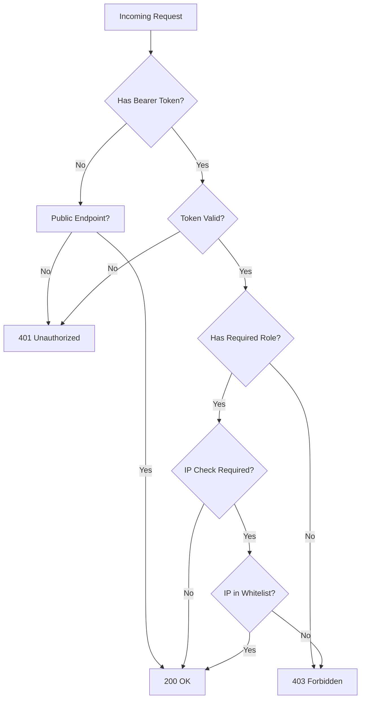
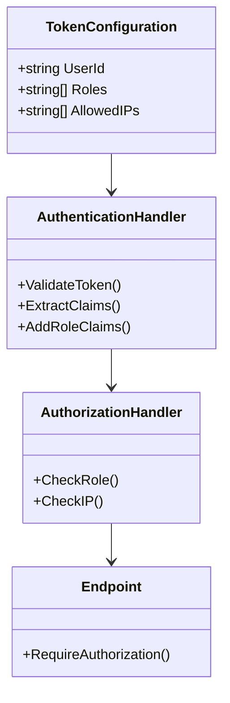
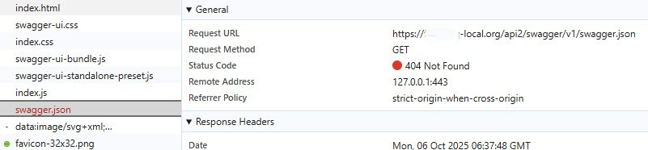
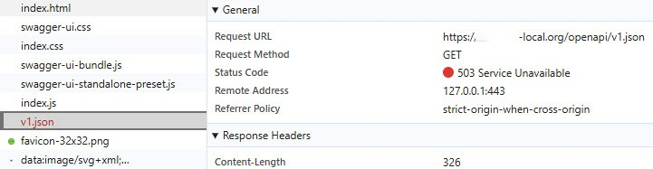
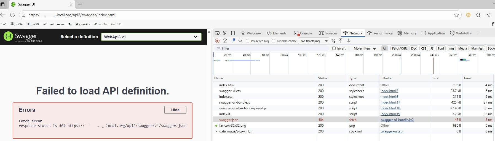

# Web Api Weather Demo with AuthN and AuthZ and Roles and Swagger UI

***Disclaimer: Created in half a day using Claude Sonnet 4.5 (Preview). Have read through all the code generated and made adjustments. Have read the documentation as well but fairly fast so I am sure there are mistakes there and wrong claims etc etc. Anyhow the code appears to work for my purpose.***

## Overview

This is a **demonstration ASP.NET Core Web API** (.NET 10) showcasing authentication and authorization patterns with Swagger UI integration for IIS deployment. The project serves as a reference implementation for securing REST APIs with opaque bearer tokens, role-based access control (RBAC), and IP whitelisting.

### Purpose

This demo provides a production-ready template for:
- Multi-tier API security (public, authenticated, partner-specific, same-host endpoints)
- Bearer token authentication (RFC 6750 compliant)
- Role-based authorization with defense-in-depth security
- Partner API integration with IP restrictions
- Same-host endpoint protection (for web app + API on same machine)
- OpenAPI/Swagger documentation in IIS environments

### Key Features

- ✅ **Opaque Bearer Token Authentication** - Custom authentication handler with configurable tokens
- ✅ **Role-Based Authorization (RBAC)** - Fine-grained access control with roles (Partner1, DataReader, DataWriter, Admin)
- ✅ **IP Whitelisting** - Per-token IP address restrictions for partner security
- ✅ **Same-Host Policy** - Restrict endpoints to same-machine access (detects local IPs + configurable additional IPs)
- ✅ **Defense-in-Depth** - Multi-layer security: Token + Role + IP validation
- ✅ **Swagger UI in IIS** - OpenAPI documentation (somewhat) working (.NET10) in IIS
- ✅ **Configuration-Based** - All tokens, roles, and IP restrictions in appsettings.json
- ✅ **RFC 6750 Compliant** - Proper WWW-Authenticate headers for 401/403 responses
- ✅ **Cloud-Ready** - Handles hairpin NAT scenarios (AWS EC2, Azure VMs)
- ✅ **Extensible Architecture** - Easy to extend with rate limiting, token expiration, database storage

### Technology Stack

- **Framework**: ASP.NET Core 10 (Minimal APIs)
- **Authentication**: Custom Bearer Token Handler
- **Authorization**: Policy-Based Authorization
- **Documentation**: OpenAPI 3.0 + Swagger UI
- **Hosting**: IIS / Kestrel
- **Configuration**: appsettings.json

## Architecture

### Security Flow



### Endpoint Authorization Matrix



### Token Configuration Model



### Authorization Policies

| Endpoint Type | Policy | Token | Role | IP Check | Use Case |
|--------------|--------|-------|------|----------|----------|
| `/publicweather/*` | `AllowAnonymous` | ❌ No | ❌ No | ❌ No | Public API, no restrictions |
| `/privateweather/*` | `BearerTokenPolicy` | ✅ Yes | ❌ No | ❌ No | Authenticated users only |
| `/privateclient1weather/*` | `Partner1Policy` | ✅ Yes | ✅ Partner1 | ✅ Yes | Partner-specific with IP restrictions |
| `/samehostweather/*` | `SameHostPolicy` | ❌ No | ❌ No | ✅ Same machine | Web app on same host (no token) |

## Quick Start

### 1. Clone and Build

```bash
git clone https://github.com/Stein-Tore/WebApiWeatherDemoAuthnAutnzSwaggerUI.git
cd WebApiWeatherDemoAuthnAutnzSwaggerUI
dotnet build
```

### 2. Configure Tokens

Edit `appsettings.json`:

```json
{
  "Authentication": {
    "BearerTokens": {
      "your-token-here": {
        "UserId": "user1",
        "Roles": ["User", "DataReader"],
        "AllowedIPs": []
      }
    }
  }
}
```

### 3. (Optional) Configure Same-Host Policy for Cloud

If deploying to AWS EC2, Azure VM, or behind NAT where hairpin routing occurs:

```json
{
  "Authorization": {
    "SameHostPolicy": {
      "AdditionalSameHostIPs": [
        "52.19.108.174"
      ]
    }
  }
}
```

### 4. Run

```bash
dotnet run
```

Navigate to `https://localhost:7025/swagger`

### 5. Test Endpoints

```bash
# Public endpoint - no auth
curl https://localhost:7025/publicweather/weatherforecast

# Private endpoint - requires token
curl -H "Authorization: Bearer demo-token-12345" \
  https://localhost:7025/privateweather/weatherforecast

# Partner endpoint - requires token + role + IP
curl -H "Authorization: Bearer partner1-token-xyz" \
  https://localhost:7025/privateclient1weather/weatherforecast

# Same-host endpoint - requires request from same machine
curl https://localhost:7025/samehostweather/weatherforecast
```

## Project Structure

```
WebApiWeatherDemoAuthnAutnzSwaggerUI/
├── Authentication/
│   ├── IOpaqueTokenValidator.cs              # Token validation interface
│   ├── ConfigurationOpaqueTokenValidator.cs  # Config-based implementation
│   ├── OpaqueTokenAuthenticationHandler.cs   # Bearer token auth handler
│   └── BearerTokenOptions.cs                 # Configuration models
├── Authorization/
│   ├── AllowedIpAuthorizationHandler.cs      # IP whitelist validator
│   ├── LocalhostAuthorizationHandler.cs      # Same-host authorization (SameHostPolicy)
│   └── SameHostPolicyOptions.cs              # Same-host configuration options
├── Endpoints/
│   ├── UnAuthenticatedEndpoints.cs           # Public endpoints
│   ├── AuthenticatedEndpoints.cs             # Private + partner endpoints
│   └── SameHostEndpoints.cs                  # Same-host endpoints
├── Program.cs                                 # App configuration
├── appsettings.json                           # Token configuration
└── TESTING_ENDPOINTS.md                       # Testing guide
```

## Use Cases

### 1. Public API
No authentication required - suitable for public data.

### 2. Authenticated User API
Basic bearer token authentication - for registered users.

### 3. Partner Integration
Multi-layer security for B2B integrations:
- Valid bearer token
- Partner-specific role
- IP whitelist (partner's server IPs)

**Example**: Partner company accesses your API from their servers at `203.0.113.10` and `203.0.113.11`.

### 4. Same-Host Endpoints
For scenarios where a web application and API run on the same machine and need to communicate without requiring bearer tokens:

**How it works:**
- Automatically detects loopback (127.0.0.1, ::1)
- Automatically detects all IP addresses bound to local network interfaces
- Supports additional IPs via configuration (for hairpin NAT/cloud scenarios)
- No authentication required - relies on network-level same-machine verification

**Common scenarios:**
- Web app and API deployed on same IIS server
- Containerized apps sharing the same host network
- AWS EC2 / Azure VM with web app calling API via public IP (hairpin NAT)
- Health check endpoints that should only be accessible locally

**Security note:** Only use `SameHostPolicy` when the web app and API are on the same physical or virtual machine. For separate machines, use bearer token authentication.

## Security Features

### Defense-in-Depth

For sensitive partner endpoints, three security layers are enforced:

1. **Authentication** - Valid bearer token
2. **Authorization** - Required role (e.g., Partner1, DataWriter)
3. **Network** - IP whitelist validation

**Example Configuration:**
```json
"partner1-prod-token": {
  "UserId": "partner1-production",
  "Roles": ["Partner1", "DataReader"],
  "AllowedIPs": ["203.0.113.10", "203.0.113.11"]
}
```

### Same-Host Security

The `SameHostPolicy` provides network-level same-machine verification:

1. **Automatic detection** - Discovers all local IP addresses at startup
2. **Loopback support** - Always accepts 127.0.0.1 and ::1
3. **IPv6 support** - Normalizes IPv6-mapped IPv4 addresses
4. **Configurable extensions** - Add public IPs for hairpin NAT scenarios

**Configuration example (AWS EC2 with Elastic IP):**
```json
{
  "Authorization": {
    "SameHostPolicy": {
      "AdditionalSameHostIPs": [
        "52.19.108.174"
      ]
    }
  }
}
```

**Why you might need `AdditionalSameHostIPs`:**
- **Hairpin NAT**: On AWS EC2, when calling the API via its public hostname/IP from the same instance, the request appears to come from the Elastic IP, not localhost
- **Load balancer scenarios**: Some configurations cause same-machine requests to appear from external IPs
- **Network proxies**: Reverse proxies may present a different source IP

**Best practices:**
- Prefer calling via `localhost` or private IP when possible
- Only add public IPs to `AdditionalSameHostIPs` if hairpin NAT is unavoidable
- Never use `SameHostPolicy` for APIs and web apps on different machines

### RFC 6750 Compliance

Follows OAuth 2.0 Bearer Token Usage specification:
- **401 Unauthorized** - Missing or invalid token (includes `WWW-Authenticate` header)
- **403 Forbidden** - Valid token but insufficient permissions (role or IP)

## Extending This Demo

### Add Rate Limiting

```csharp
builder.Services.AddRateLimiter(options => {
    options.AddFixedWindowLimiter("api-rate-limit", opt => {
        opt.PermitLimit = 100;
        opt.Window = TimeSpan.FromMinutes(1);
    });
});

// Apply to endpoint
.RequireRateLimiting("api-rate-limit")
```

### Add Token Expiration

Extend `TokenConfiguration` with `ExpiresAt` property and validate in authentication handler.

### Migrate to Database

Replace `ConfigurationOpaqueTokenValidator` with `DatabaseOpaqueTokenValidator` for production scale.

See `TESTING_ENDPOINTS.md` for database migration examples.

### Add Diagnostics Endpoints

For troubleshooting same-host policy issues:

```csharp
// See remote IP as seen by API
app.MapGet("/diagnostics/remoteip", (HttpContext ctx) => 
    Results.Ok(new { RemoteIp = ctx.Connection.RemoteIpAddress?.ToString() }))
    .AllowAnonymous();

// See all same-host IPs (requires same-host access)
app.MapGet("/diagnostics/localaddresses", () => /* implementation */)
    .RequireAuthorization("SameHostPolicy");
```

## Documentation

- **[TESTING_ENDPOINTS.md](TESTING_ENDPOINTS.md)** - Complete testing guide with curl examples
- **Swagger UI** - Interactive API documentation at `/swagger`
- **OpenAPI Spec** - JSON specification at `/openapi/v1.json`

## Using This Demo as a Reference

When working on your production Web API projects in Visual Studio 2025/2026, you can reference this demo project in several ways when using GitHub Copilot:

### 1. Reference the GitHub Repository URL

Simply mention the repository URL in your question:
```
"How do I implement authentication like in 
https://github.com/Stein-Tore/WebApiWeatherDemoAuthnAutnzSwaggerUI?"
```

### 2. Reference Specific Files from the Demo

```
"Can you show me how to configure Swagger with JWT like in 
Program.cs from my demo project at 
https://github.com/Stein-Tore/WebApiWeatherDemoAuthnAutnzSwaggerUI?"
```

### 3. Keep Both Solutions Open

- Open both solutions side-by-side in Visual Studio
- GitHub Copilot will have context from both workspaces
- You can say: "Apply the authentication pattern from my demo project to this controller"

### 4. Clone and Reference Locally

```
"Use the same authentication setup as in 
C:\z\ste\d\dev\GitHub\Stein-Tore\WebApiWeatherDemoAuthnAutnzSwaggerUI"
```

### 5. Be Specific About What to Replicate

```
"Add JWT authentication to this project using the same 
configuration as the WeatherController in my demo project"
```

GitHub Copilot can fetch the repository content and help you apply the same patterns to your production Web API projects.

## License

MIT License - Free to use in your projects.

## Contributing

This is a demo/reference project. Feel free to fork and adapt for your needs.

---

# Tasks

## Task 1 - Get Swagger UI to work running in IIS.

***NOTE: VS must run as admin to debug in IIS.***

### Summary of findings

DO NOT set `"launchBrowser": true` in profile for IIS. Simply browse to `.../swagger` from a browser you open.

It may still fail with 404 or 503 errors. If so, `iisreset` should fix it. Also closing the browser and reopening it may work.
Crtl-F5 to force reload the page may also work.
Seems pretty random.

### The prosess to work out the above

Create ASP.NET Core Web API project.

Modify `launchSettings.json`:

         "launchBrowser": true,
         "launchUrl": "https://localhost:7025/openapi/v1.json",

F5 -> https://localhost:7025/openapi/v1.json - ok.


### Add Swagger

`Program.cs`:  

      app.UseSwaggerUI();

modify `launchSettings.json`:

         "launchUrl": "https://localhost:7025/swagger",

F5 -> https://localhost:7025/swagger/index.html - ok.


### Run in IIS

Start VS as admin.

`Program.cs` (as before):  

      app.UseSwaggerUI();

Add to `launchSettings.json`:

         "IIS": {
            "commandName": "IIS",
            "launchBrowser": true,
            "launchUrl": "https://example-local.com/api2/openapi/v1.json",
            "environmentVariables": {
               "ASPNETCORE_ENVIRONMENT": "Development"
            }
         }
      },
      "iisSettings": {
         "windowsAuthentication": false,
         "anonymousAuthentication": true,
         "iis": {
            "applicationUrl": "https://example-local.com/api2/",
            "sslPort": 0
         }
      }

F5 -> https://example-local.com/api2/openapi/v1.json - ok


Change to `"launchUrl": "https://example-local.com/api2/swagger",`

Now we get

      Fetch error
      response status is 404 https://example-local.com/api2/swagger/v1/swagger.json




Change `Program.cs`:

      app.UseSwaggerUI(options => options.SwaggerEndpoint("/openapi/v1.json", "v1"));

Now we get

      Fetch error
      response status is 503 /openapi/v1.json




404:  



After mucking around a bit we get 503 every time regardless wrt the above with IIS. Some cache thing or what with the swagger js bundles???

### Final fix

`iisreset`.

`Program.cs`:

      app.MapOpenApi();
      app.UseSwaggerUI();
      //app.UseSwaggerUI(options => options.SwaggerEndpoint("/openapi/v1.json", "v1"));
      app.MapGet("/swagger/v1/swagger.json", (HttpContext ctx) => Results.Redirect($"{ctx.Request.PathBase}/openapi/v1.json")); // Compatibility shim for Swagger UI default discovery path: /swagger/v1/swagger.json -> /openapi/v1.json (preserve PathBase)

Modify `launchSettings.json`:

      "launchBrowser": false

F5

Open a browser and navigate to https://example-local.com/api2/swagger - ok.

## Task 2 - Protect Endpoints

      app.MapPublicWeatherEndpoints(); // Should be avaliable to anonymous users, i.e. not authenticated.
      app.MapPrivateWeatherEndpoints(); // Should only be available for authenticated users.
      app.MapSameHostWeatherEndpoints(); // Should only be available for web application(s) running on the same host

### Implemented Solution

**Multi-tier authorization pattern using custom authorization policies with role-based access, IP whitelisting, and same-host verification:**

1. **Public endpoints** - `.AllowAnonymous()`

2. **Private endpoints** - `.RequireAuthorization("BearerTokenPolicy")`
   - Custom authentication handler validates opaque bearer tokens
   - Token configuration stored in `appsettings.json`
   - Authentication middleware extracts token from `Authorization: Bearer {token}` header

3. **Partner-specific endpoints** - `.RequireAuthorization("Partner1Policy")`
   - Requires specific role (e.g., `Partner1`)
   - Validates IP address against token's `AllowedIPs` whitelist
   - Defense-in-depth: Token + Role + IP address

4. **Same-host endpoints** - `.RequireAuthorization("SameHostPolicy")`
   - Custom policy checks `HttpContext.Connection.RemoteIpAddress` against:
     - Loopback addresses (127.0.0.1, ::1, IPv6-mapped loopback)
     - All IP addresses bound to active network interfaces
     - Additional configured IPs (for hairpin NAT / cloud scenarios)
   - No bearer token required - network-level verification only

### Token Configuration Structure

```json
"Authentication": {
  "BearerTokens": {
    "token-string": {
      "UserId": "username",
      "Roles": ["Role1", "Role2"],
      "AllowedIPs": ["203.0.113.10", "203.0.113.11"]
    }
  }
}
```

- **UserId**: User identifier
- **Roles**: Array of roles for authorization (e.g., Partner1, DataReader, DataWriter)
- **AllowedIPs**: IP whitelist (empty array = no IP restrictions)

### Same-Host Policy Configuration

```json
"Authorization": {
  "SameHostPolicy": {
    "AdditionalSameHostIPs": ["52.19.108.174"]
  }
}
```

- **AdditionalSameHostIPs**: Optional array of additional IPs to treat as "same host"
  - Use for hairpin NAT scenarios (AWS EC2 Elastic IP, Azure public IP)
  - Use when load balancer/proxy causes same-machine calls to appear external
  - Empty array (or omit) = only loopback + NIC IPs

### Authorization Policies

| Policy | Authentication | Role | IP Check | Network Check |
|--------|---------------|------|----------|---------------|
| `BearerTokenPolicy` | ✅ Required | ❌ None | ❌ No | ❌ No |
| `Partner1Policy` | ✅ Required | ✅ Partner1 | ✅ Yes | ❌ No |
| `DataReaderPolicy` | ✅ Required | ✅ DataReader | ❌ No | ❌ No |
| `DataWriterPolicy` | ✅ Required | ✅ DataWriter | ✅ Yes | ❌ No |
| `SameHostPolicy` | ❌ None | ❌ None | ❌ No | ✅ Same machine |

### Key Components Implemented

- `TokenConfiguration` - Configuration model for tokens with UserId, Roles, AllowedIPs
- `ConfigurationOpaqueTokenValidator` - Reads token configuration from appsettings.json
- `OpaqueTokenAuthenticationHandler` - Validates bearer tokens and adds role/IP claims
- `AllowedIpAuthorizationHandler` - Validates request IP against token's AllowedIPs
- `SameHostAuthorizationHandler` - Validates request originates from same machine
- `SameHostPolicyOptions` - Configuration for additional same-host IPs
- Authorization policies for different access levels

### Benefits

- **Declarative** - Use `.RequireAuthorization()` on endpoint groups
- **Flexible** - Mix and match policies (role-only, role+IP, same-host, etc.)
- **Defense-in-depth** - Multiple security layers for sensitive endpoints
- **Configuration-based** - Easy to manage tokens and IPs in appsettings
- **Standard ASP.NET Core** - Uses built-in authentication/authorization pipeline
- **RFC 6750 compliant** - Proper WWW-Authenticate headers
- **Cloud-ready** - Handles hairpin NAT and various network topologies

### Example Usage

```csharp
// Public endpoint - no restrictions
routes.MapGroup("/public").AllowAnonymous()

// Authenticated users only
routes.MapGroup("/private").RequireAuthorization("BearerTokenPolicy")

// Partner-specific with IP restrictions
routes.MapGroup("/partner1").RequireAuthorization("Partner1Policy")

// Same-host only (no token, network verification)
routes.MapGroup("/samehost").RequireAuthorization("SameHostPolicy")

// Different requirements for GET vs POST
var group = routes.MapGroup("/data");
group.MapGet("/items", ...).RequireAuthorization("DataReaderPolicy");  // Read-only
group.MapPost("/items", ...).RequireAuthorization("DataWriterPolicy"); // Write requires IP check
```

### Future Enhancements

- **Rate limiting** - Prevent abuse from compromised partners
- **Token expiration** - Add time-based token validity
- **Database storage** - Move from appsettings to database for production scale
- **Token rotation** - Implement refresh tokens for long-lived partnerships
- **Diagnostics endpoints** - Add endpoints to troubleshoot IP detection and same-host policy


